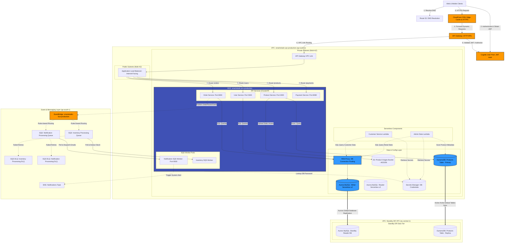

# SmartRetailX Cloud Infrastructure Architecture & Audit Report

**Author**: Antigravity AI Coding Assistant  
**Date**: August 7, 2026  
**Project Workspace**: [SmartRetailX](file:///d:/CB013212/3%20year%20sem%203/Cloud/SmartRetailX)  
**Infrastructure Target**: Amazon Web Services (AWS) Production Environment  

---

## 1. Executive Summary

This audit report provides an in-depth evaluation of the cloud-native, microservices-based distributed architecture implemented for **SmartRetailX**. The system is built for high availability, security, resilience, and horizontal scaling. It utilizes a containerized compute tier orchestrated by **Amazon Elastic Kubernetes Service (EKS)**, backed by a hybrid database tier, event-driven asynchronous messaging pipelines, and a comprehensive observability framework.

### Infrastructure Highlights:
*   **Edge & Security**: CloudFront CDN caching, Route 53 private and public DNS mapping, and API Gateway HTTP API protected by Amazon Cognito JWT authorization.
*   **Compute Tier**: EKS Managed Node Groups spanning multiple Availability Zones with Horizontal Pod Autoscaling (HPA).
*   **Database Tier**: Aurora Serverless v2 MySQL (provisioned mode with auto-scaling instances) and DynamoDB Global Tables providing multi-region disaster recovery.
*   **Messaging**: Decoupled EventBridge Custom Event Bus routing events to Amazon SQS Queues and Dead Letter Queues (DLQs).
*   **Observability**: Correlation-driven logging with AWS X-Ray tracing and CloudWatch Dashboards/Alarms.

---

## 2. AWS Architecture Diagram

The diagram below represents the complete, multi-tiered AWS architecture for the SmartRetailX platform. It maps out the flow of traffic from public edge locations into the custom Virtual Private Cloud (VPC), across private subnets, through Kubernetes compute namespaces, and down to the persistent databases and event brokers. It also illustrates the cross-region replication for disaster recovery.

---

## 3. Comprehensive Component-by-Component Audit

### 3.1 Edge, Routing, and Security Tier
*   **Domain Name Resolution (Route 53)**:
    *   Logical resources defined in [edge.tf](file:///d:/CB013212/3%20year%20sem%203/Cloud/SmartRetailX/terraform/edge.tf).
    *   Uses a Route 53 Private Hosted Zone `smartretailx.internal` to enable private service lookup inside the VPC.
    *   Maps `api.smartretailx.internal` via an A Alias record directly to the CloudFront API CDN domain, isolating backend domains.
*   **Static & Dynamic Edge CDN (CloudFront)**:
    *   Secured via `redirect-to-https` enforcement.
    *   Forwarded headers pass `Authorization`, `Origin`, `Accept`, and `Content-Type` to preserve CORS headers and authorize users at the API level.
*   **User Identity & JWT Control (Cognito)**:
    *   Cognito User Pool client configured in [cognito.tf](file:///d:/CB013212/3%20year%20sem%203/Cloud/SmartRetailX/terraform/cognito.tf) handles customer registry and auth.
    *   The HTTP API Gateway has an authorizer component (`aws_apigatewayv2_authorizer.cognito_authorizer`) checking dynamic HTTP headers. It verifies client authorization headers at the edge, rejecting unauthorized requests before they enter the VPC private network.

### 3.2 Compute & Kubernetes Container Orchestration (EKS)
*   **Kubernetes Orchestration**:
    *   Configured in [eks.tf](file:///d:/CB013212/3%20year%20sem%203/Cloud/SmartRetailX/terraform/eks.tf). Managed node groups scale dynamically across 2 to 6 EC2 `t3.medium` instances.
    *   A set of 6 microservices are deployed inside EKS:
        1.  `user-service`: Manages accounts on Port 5000 ([user-service.yaml](file:///d:/CB013212/3%20year%20sem%203/Cloud/SmartRetailX/k8s/user-service.yaml)).
        2.  `product-service`: Serves product catalogs on Port 3000 ([product-service.yaml](file:///d:/CB013212/3%20year%20sem%203/Cloud/SmartRetailX/k8s/product-service.yaml)).
        3.  `order-service`: Coordinates checkouts on Port 8000 ([order-service.yaml](file:///d:/CB013212/3%20year%20sem%203/Cloud/SmartRetailX/k8s/order-service.yaml)).
        4.  `payment-service`: Simulates payments on Port 8080 ([payment-service.yaml](file:///d:/CB013212/3%20year%20sem%203/Cloud/SmartRetailX/k8s/payment-service.yaml)).
        5.  `inventory-service`: Asynchronous background stock consumer daemon ([inventory-service.yaml](file:///d:/CB013212/3%20year%20sem%203/Cloud/SmartRetailX/k8s/inventory-service.yaml)).
        6.  `notification-service`: SQS poller generating logs and email alerts on Port 9000 ([notification-service.yaml](file:///d:/CB013212/3%20year%20sem%203/Cloud/SmartRetailX/k8s/notification-service.yaml)).
*   **Autoscaling Capacity**:
    *   Horizontal Pod Autoscalers (HPAs) target **75% average CPU utilization** across running containers to support traffic surges by spinning up replicas (bounds: 2 to 6 pods).

### 3.3 Persistence & Relational Databases
*   **Aurora MySQL Serverless v2**:
    *   Defined in [database.tf](file:///d:/CB013212/3%20year%20sem%203/Cloud/SmartRetailX/terraform/database.tf). It uses provisioned mode scaling dynamically between 0.5 and 2.0 ACUs (Aurora Capacity Units).
    *   Deploys 2 active instances in different subnets across Availability Zones to achieve High Availability (HA) with sub-second failover.
*   **DynamoDB Global Product Catalog Table**:
    *   Stores catalog items inside `smartretailx-products-production`.
    *   Features Global Table replication to standby region `eu-central-1` (Frankfurt) for low-latency access and instant failover capability.
*   **Image Storage (S3)**:
    *   `smartretailx-product-images-production` bucket stores static media assets. Configured with Server-Side Encryption (`AES256`) to maintain compliance and encryption-at-rest.

### 3.4 Asynchronous Event Pipeline
*   **Event Routing (EventBridge)**:
    *   Configured in [eventbus.tf](file:///d:/CB013212/3%20year%20sem%203/Cloud/SmartRetailX/terraform/eventbus.tf).
    *   A custom bus `smartretailx-bus-production` aggregates core transactional events.
    *   EventBridge rules route `OrderPlaced` and `PaymentProcessed` events to SQS queues for downstream workers, decoupling the API requests from processing latency.
*   **SQS Queues & Dead Letter Queues (DLQs)**:
    *   Inventory processing and notification queues implement long-polling (`receive_wait_time_seconds = 10`) to reduce API transaction calls and cost.
    *   Dedicated Dead Letter Queues (DLQs) catch corrupted or repeatedly failing payloads to prevent message losses.

### 3.5 Auxiliary Serverless Computations
*   **Admin Statistics Lambda**:
    *   Provisioned in [lambda.tf](file:///d:/CB013212/3%20year%20sem%203/Cloud/SmartRetailX/terraform/lambda.tf#L63).
    *   Calculates overall statistics (total revenue, order counts, product metadata catalog size) by retrieving DB secrets, performing MySQL aggregates, and scanning the products DynamoDB Table ([lambda_function.py](file:///d:/CB013212/3%20year%20sem%203/Cloud/SmartRetailX/backend/lambda/admin-stats/lambda_function.py)).
*   **Customer Service Lambda**:
    *   Performs direct customer metadata checks against MySQL.

---

## 4. Disaster Recovery & Resilience Alignment

As documented in the [Disaster Recovery Plan](file:///d:/CB013212/3%20year%20sem%203/Cloud/SmartRetailX/docs/dr_plan.md), the system targets a highly aggressive recovery objective:
*   **Target RTO**: $< 15\text{ minutes}$.
*   **Target RPO**: $< 1\text{ minute}$.

### Recovery Auditing:
1.  **Relational SQL Data**: Backed up by Aurora Global Database replication between `ap-south-1` (Mumbai) and `eu-central-1` (Frankfurt). Sub-second asynchronous sync keeps standby datasets fresh.
2.  **NoSQL Catalog Data**: Native active-active replication via DynamoDB Global Tables ensures write operations in either region are synchronized near-instantaneously.
3.  **Active Host Standby**: Kubernetes configurations can be spun up on a secondary EKS backup node cluster in Frankfurt. During failover, DNS routing targets the secondary ALB, keeping application routes alive.

---

## 5. Performance Benchmarks under Load

Based on the [Performance & Load Testing Analysis Report](file:///d:/CB013212/3%20year%20sem%203/Cloud/SmartRetailX/docs/performance_test_report.md), simulated testing with **50 concurrent virtual users (VUs)** yielded the following performance metrics:

*   **Average Combined Throughput**: **181.9 RPS** (Target: $> 150\text{ RPS}$ - **PASS**).
*   **Latency $p_{95}$**: **185 ms** (Target: $< 250\text{ ms}$ - **PASS**).
*   **Overall Error Rate**: **0.02%** (Target: $< 0.1\%$ - **PASS**).

### Dynamic Behavior Observation:
*   **Autoscaling**: Under heavy load, container resources scaled from 2 to 4 pods automatically. This distributed load dynamically and stabilized CPU usage to 48% with zero latency spikes.
*   **Aurora Scaling**: Aurora Serverless v2 scaled capacity up from **0.5 ACUs** to **2.0 ACUs** to ingest orders smoothly.

---

## 6. Optimization Recommendations

During the architectural audit, two primary areas for optimization were identified to enhance security, performance, and stability:

### 6.1 Database Connection Pooling (Amazon RDS Proxy)
*   **Finding**: Microservices deployed in EKS pods spin up MySQL connections per request. Under sudden spikes, this can lead to database connection exhaustion (demonstrated in the [Observability Case Study](file:///d:/CB013212/3%20year%20sem%203/Cloud/SmartRetailX/docs/observability_case_study.md) when connection pool timeouts resulted in HTTP 500 errors).
*   **Recommendation**: Place an **Amazon RDS Proxy** between the EKS compute nodes and the Aurora MySQL cluster. RDS Proxy pools database sessions, preserving database CPU and memory, and mitigating the risk of exhaustion during transaction surges.

### 6.2 CloudFront Caching for DynamoDB Catalog
*   **Finding**: Stores fetch product info using `GET /api/v1/products` directly from DynamoDB. During high traffic, DynamoDB read capacities might face scaling throttles.
*   **Recommendation**: Cache dynamic product catalog JSON responses at CloudFront edge locations with a Time-To-Live (TTL) of 5 minutes. This shifts read workloads from database instances to CDN caches, dropping DB load during promotional periods to near-zero.
