# SmartRetailX AWS Cloud Architecture Specification

This document details the multi-tier, cloud-native distributed architecture for **SmartRetailX** deployed on Amazon Web Services (AWS) across multi-Availability Zones (`ap-south-1`) with Cross-Region Disaster Recovery (`ap-southeast-1`).

---

## Complete AWS Cloud Architecture Diagram

---

## Detailed System Component Interaction Diagram

```mermaid
graph TD
    %% User Clients
    Client[Web & Mobile Web Clients]
    
    %% Edge Layer
    subgraph Edge_Security["1. Edge & Auth Layer (Global / Regional)"]
        R53[Amazon Route 53: DNS]
        CF[Amazon CloudFront: Global CDN]
        WAF[AWS WAF: Web Application Firewall]
        Cognito[Amazon Cognito: User Pool & JWT Authorizer]
        APG[Amazon API Gateway: HTTP APIs]
    end

    %% Networking Tier
    subgraph VPC["2. AWS VPC (ap-south-1 Multi-AZ)"]
        subgraph Public_Subnets["Public Subnets (AZ-a / AZ-b / AZ-c)"]
            NAT[NAT Gateways]
            ALB_Front[Frontend ALB: Port 3000]
            ALB_Back[Backend ALB: Port 8080]
        end

        subgraph Private_Subnets["Private Compute Subnets (AZ-a / AZ-b / AZ-c)"]
            subgraph EKS_Cluster["Amazon EKS Container Cluster"]
                US[user-service Pods]
                PS[product-service Pods]
                OS[order-service Pods]
                PAY[payment-service Pods]
                INV[inventory-worker Pods]
                NOT[notification-worker Pods]
                WS[websocket-gateway Pods]
            end
            MSK[Amazon MSK: Kafka Stream Cluster]
        end

        subgraph Database_Subnets["Isolated Database Subnets (AZ-a / AZ-b)"]
            RDSPROXY[Amazon RDS Proxy: Connection Pool]
            RDS[(Amazon Aurora RDS: MySQL 8.0 ACID)]
            REDIS[(Amazon ElastiCache: Redis Cache)]
        end
    end

    %% Persistence & Storage
    subgraph Data_Layer["3. Database & Object Storage Tier"]
        DDB[(Amazon DynamoDB: Global Catalog Table)]
        S3[(Amazon S3: Product Images & Invoice PDFs)]
        ECR[(Amazon ECR: Docker Image Registry)]
    end

    %% Event & Serverless Messaging
    subgraph Async_Messaging["4. Event-Driven Messaging & Serverless"]
        EB[Amazon EventBridge: smartretailx-bus]
        SQS_Inv[SQS: inventory-processing-queue]
        SQS_Not[SQS: notification-queue]
        Lambda_Admin[AWS Lambda: admin-stats]
        Lambda_Customer[AWS Lambda: customer-service]
        SES[Amazon SES: Email Dispatch]
    end

    %% Monitoring & Disaster Recovery
    subgraph Observability_Tier["5. Observability & Multi-Region DR"]
        Prom[Prometheus Server: Metrics Collector]
        Graf[Grafana Dashboard: Telemetry UI]
        XRay[AWS X-Ray Daemon: Distributed Tracing]
        Loki[Grafana Loki: Log Aggregation]
        AWS_Backup[AWS Backup Vault: Cross-Region Copy to ap-southeast-1 Singapore]
    end

    %% Traffic Connections
    Client -->|1. Resolve DNS| R53
    Client -->|2. Authenticate & Obtain JWT| Cognito
    Client -->|3. HTTPS Request| CF
    CF -->|Filter Bad Traffic| WAF
    WAF -->|Validated Ingress| APG
    APG -->|Route /api/v1/*| ALB_Back
    CF -->|Static Frontend Assets| ALB_Front

    ALB_Back --> US & PS & OS & PAY & WS

    %% Service Data Connections
    US & OS -->|Connection Pool| RDSPROXY
    RDSPROXY --> RDS
    PS -->|NoSQL Queries| DDB
    PS & Lambda_Customer -->|Store/Retrieve Media| S3
    EKS_Cluster -->|Pull Images| ECR

    %% Event Flows
    OS -.->|Publish OrderPlaced Event| EB
    EB -.->|Route Inventory Event| SQS_Inv
    EB -.->|Route Notification Event| SQS_Not
    SQS_Inv -.->|Poll Deduct Stock| INV
    SQS_Not -.->|Poll Process Email| NOT
    NOT -.->|Trigger Email| SES
    EB -.->|Trigger Customer Lambda| Lambda_Customer

    %% Telemetry Flows
    EKS_Cluster -.->|Metrics| Prom
    EKS_Cluster -.->|Traces| XRay
    EKS_Cluster -.->|Container Logs| Loki
    Prom -.->|Query Datasource| Graf
    Loki -.->|Query Logs| Graf

    %% Backup Replication
    RDS & DDB & S3 -.->|Daily WORM Snapshot Copy| AWS_Backup
```

---

## AWS Infrastructure Architecture Summary

| AWS Service | Architecture Layer | Function & Technical Justification |
| :--- | :--- | :--- |
| **Amazon Route 53** | Edge Routing | Low-latency DNS resolution and global health check routing. |
| **Amazon CloudFront** | CDN / Edge | Global caching of static UI assets and HTTPS SSL termination at the edge. |
| **AWS WAF** | Edge Security | Inspects HTTPS traffic against SQL injection, XSS, and rate limits requests. |
| **Amazon Cognito** | Authentication | Manages user registration, JWT token generation, and RBAC authentication. |
| **Amazon API Gateway** | API Ingress | Central entry point enforcing JWT validation, CORS, and rate limiting. |
| **AWS VPC** | Network Isolation | Multi-AZ network topology across 3 Availability Zones (`ap-south-1a/b/c`). |
| **Amazon EKS** | Compute Orchestration | Production-grade Kubernetes cluster running microservices with HPA autoscaling. |
| **Amazon RDS (MySQL)** | SQL Persistence | Managed relational database for order and user transaction ACID compliance. |
| **Amazon RDS Proxy** | Database Proxy | High-efficiency connection pooling preventing DB connection exhaustion under peak load. |
| **Amazon DynamoDB** | NoSQL Database | High-throughput, low-latency NoSQL table storing flexible product catalog data. |
| **Amazon EventBridge** | Event Router | Asynchronous event bus (`smartretailx-bus`) decoupling order checkout from worker processing. |
| **Amazon SQS** | Queue Buffer | Message queue buffering peak transaction workloads for Inventory and Notification workers. |
| **AWS Lambda & SES** | Serverless / Mail | Serverless PDF generation and email invoice dispatching via Amazon SES. |
| **Amazon Prometheus & Grafana** | Observability | Real-time system telemetry metrics, latency percentiles, and operational dashboards. |
| **AWS Backup** | Disaster Recovery | Automated cross-region snapshot replication from Mumbai (`ap-south-1`) to Singapore (`ap-southeast-1`). |
